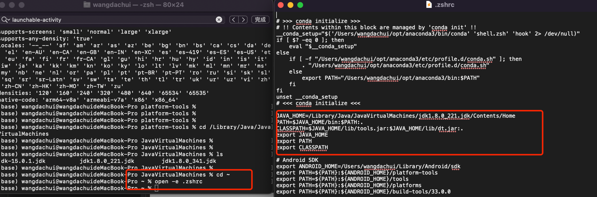
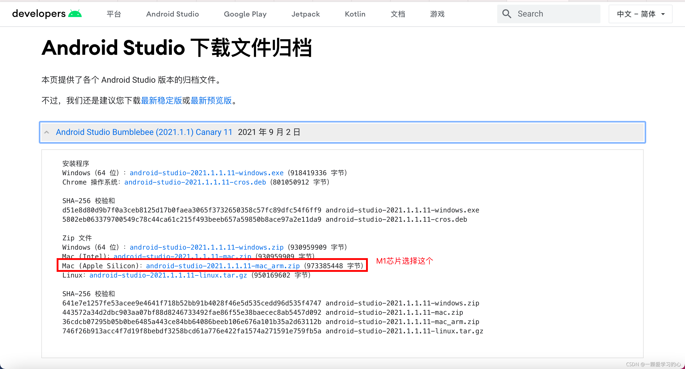
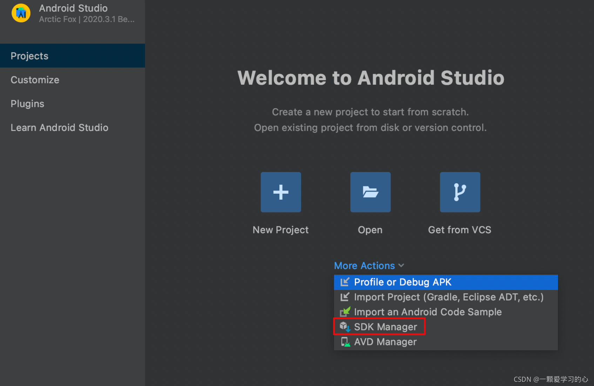
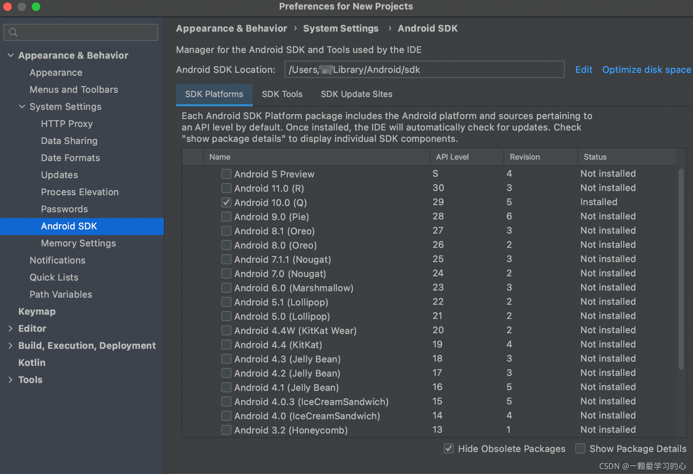
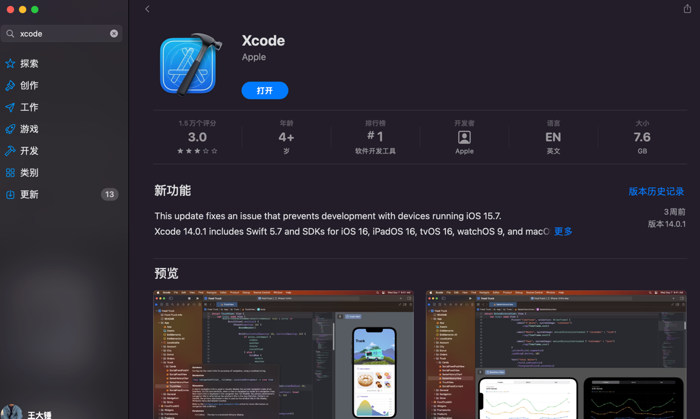
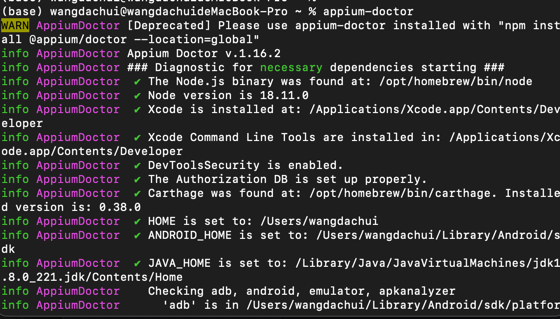
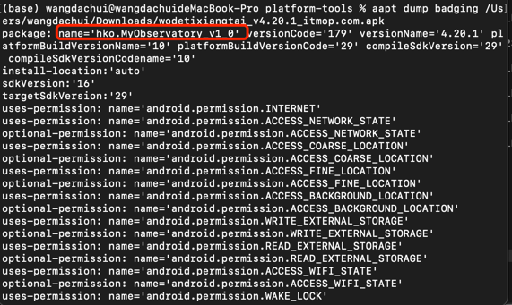
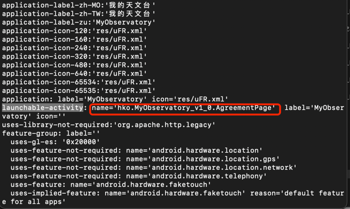

MyObservatory UI自动化介绍
## macos appium环境搭建
###一、搭建java环境
####下载jdk
`https://www.oracle.com/java/technologies/downloads/#java8`
####安装sdk
notice： 
_下载jdk1.8.0.341 的版本，配置sdk时，打开tools 文件下android一直失败，最后换成了jdk1.8.0.221版本才成功_
#### 配置环境变量
在终端内打开 ～ /.zshrc 
`JAVA_HOME=/Library/Java/JavaVirtualMachines/jdk1.8.0_221.jdk/Contents/Home
PATH=$JAVA_HOME/bin:$PATH:.
CLASSPATH=$JAVA_HOME/lib/tools.jar:$JAVA_HOME/lib/dt.jar:.
export JAVA_HOME
export PATH
export CLASSPATH`

配置完成，需要source .bash_profile 使文件生效
`source .bash_profile`

###二、安装android-sdk
#### 下载安装android studio

#### 安装完成后下载sdk

#### 配置环境变量
`# Android SDK
export ANDROID_HOME=/Users/wangdachui/Library/Android/sdk
export PATH=${PATH}:${ANDROID_HOME}/platform-tools
export PATH=${PATH}:${ANDROID_HOME}/tools
export PATH=${PATH}:${ANDROID_HOME}/platforms
export PATH=${PATH}:${ANDROID_HOME}/build-tools/33.0.0`

####三、安装Homebrew
 Homebrew 简称 brew，是Mac OSX上的软件包管理工具，能在Mac中方便的安装软件或者卸载软件
####安装：
打开终端，输入命令后等待完成即可
`/bin/zsh -c "$(curl -fsSL https://gitee.com/cunkai/HomebrewCN/raw/master/Homebrew.sh)"

###四、安装nodejs
安装 npn 前需要先安装nodejs ，打开终端，输入命令后等待完成即可
`brew install node
`接着安装npm，国内的可以直接用淘宝的npm，避免掉各种网络问题
`npm install -g cnpm --registry=https://registry.npm.taobao.org
`
###五、安装Xcode
appstore下载安装即可

###六、安装appium desktop版本
####1、官网地址：
`https://github.com/appium/appium-desktop/releases
`
####2、下载版本
下载最新版本即可

###八、环境验证
_以上步骤便是Mac 搭建appium 所需的全部环境，接下来需要对安装的环境正确性进行验证_
**安装 appium-doctor：
`sudo cnpm install appium-doctor -g
`
开始检查，在终端输入：`appium-doctor`

框框里的所有内容都☑️时，证明环境配置都正确了，如果有错误的地方，一定要进行修复

## 连接真机

#### 查看app的packageName和ActivityName
#####cmd 执行命令 
`aapt dump badging /Users/wangdachui/Downloads/wodetixiangtai_v4.20.1_itmop.com.apk`
#####packageName：

#####ActivityName
launchable-activity后面的就是Activity
